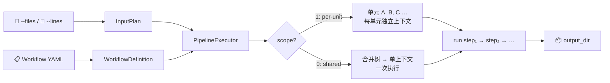
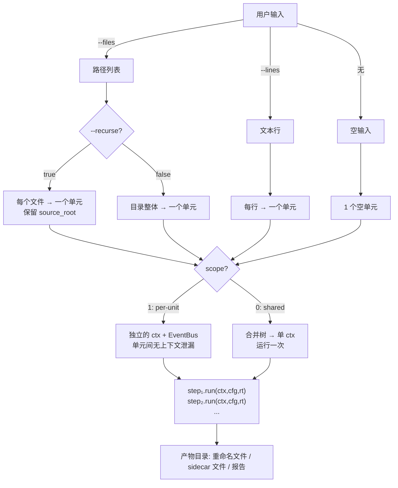

# AIYA Shell Worker Platform

按**单向管道**模型设计的模块化批量任务工作流平台，通过 YAML 编排步骤，对文件或文本输入执行批量处理、自动化任务。CLI 驱动，可选桌面 GUI，跨平台。



---

## 安装

```bash
pip install .                        # 内核 + CLI（仅 PyYAML）
pip install ".[gui]"                 # + PySide6 桌面 GUI
pip install ".[win]"                 # + pywinpty（Windows PTY）
```

Linux / macOS 上 CLI 零 GUI 依赖，PTY 由 stdlib 提供。

## 快速开始

```bash
# 1. 查看可用工作流和模块
python main.py --list-workflows
python main.py --list-modules

# 2. 爬虫工作流创建文件
python main.py example-create.yaml --output-dir ./out
# → out/hello.txt

# 3. 批量重命名文件（recurse=true, per-unit）
python main.py example-file-rename.yaml \
  --files ./my_data --recurse --output-dir ./out
# → 每个文件被安全拷贝后重命名，保留相对目录结构

# 4. 整个文件夹作为单元
python main.py example-folder-rename.yaml \
  --files ./my_folder --output-dir ./out
# → 文件夹整体作为一个任务，拷贝后重命名

# 5. 合并计数（scope=0）
python main.py example-cycle-count.yaml \
  --files ./my_data --recurse --output-dir ./out
# → 所有文件合并到产物目录，运行一次，输出 count.txt

# 6. 逐行处理文本
python main.py example-line-echo.yaml \
  --lines "alpha"$'\n'"beta" --output-dir ./out
# → 每行作为一个独立任务

# 7. 调用外部工具
python main.py example-external-tool.yaml \
  --files ./input --recurse --output-dir ./out
```

## 核心模型

内核**根据实际输入自动推导执行形状**。CLI 按 `--files` 优先、`--lines` 次之、皆空即"无输入"识别输入模式。`--files` 支持 `*`、`?`、`[]`、`**`，未匹配模式直接报错。scope（YAML 字段）决定多少个输入共享一个上下文；recurse（CLI 参数）控制目录展开。YAML 中的 `atom` 字段为可选 GUI 元数据，仅用于桌面端输入面板选择与编辑器模块过滤，内核不读它做执行判断。

最终 `output_dir` 同时是执行工作区。内核只把当前 unit 的条目加入清单，旧文件不会进入 `ctx.files()`；输入导入、创建和重命名遇到顶层冲突时整体改名为 `name (1)`，不会合并、删除或覆盖已有条目。输入目录与输出目录互相嵌套时会在导入前拒绝执行。

| 参数 | 说明 | 值 | 定义位置 |
|------|------|-----|----------|
| 输入来源 | CLI 决定输入粒度 | `--files`（路径）、`--lines`（文本行）、无（空输入） | CLI |
| scope | 上下文分发策略 | `0`（shared，合并单任务）、`1`（per-unit，独立执行） | YAML |
| recurse | 目录展开 | `true`（递归展开文件）、`false`（整体单元） | CLI |



### 使用场景对照

| 典型任务 | 输入命令 | 分批约束 | 场景 |
|---|---|---|---|
| 逐文件操作，保留目录结构 | `--files [PATH] --recurse` | `scope: 1` | 文件格式转换、预处理、元数据注入、重命名 |
| 全量合并后一次执行 | `--files [PATH] --recurse` | `scope: 0` | 混杂文件分类、跨文件统计计数 |
| 整个文件夹作为一个任务 | `--files [PATH]` | `scope: 1` | 文件夹内批量重命名、打包归档 |
| 按行输入文本作为独立任务 | `--lines` | `scope: 1` | 网络爬虫、逐行 URL 下载 |
| 无输入，从零创建 | 无输入 | `scope: 1` | API 调用、日志下载、直接产出文件 |

## CLI 参考

```
用法: shell-worker [WORKFLOW] [选项]

输入:
  --files PATH ...        文件/文件夹路径或通配符（支持 **）
  --recurse       递归开关，展开文件夹逐文件创建任务
  --lines TEXT        文本输入（逐行创建任务）
  --lines-file PATH       从文件读取文本（- 为 stdin 识别任务）

执行:
  --output-dir DIR        产物目录 (默认 ./out)
  --direct        普通模式直接操作原文件；监听模式移动变化文件
  --modules-dir DIR       模块目录 (默认 ./modules)
  --workflows-dir DIR       工作流目录 (默认 ./workflows)

调度:
  --concurrency N       并发启动任务
  --watch       只处理启动后的新增/修改/移入文件，不执行目录现有内容
  --cron * * * *        定时任务
  
日志:
  --log BOOL         生成 JSON 行式事件日志

自检:
  --list-workflows        列出全部工作流
  --list-modules          列出全部模块

退出码: 0=成功 | 1=部分失败 | 2=取消 | 3=参数非法 | 4=未处理内部错误
```

## 工作流 YAML 结构

```yaml
meta:
  name: My Workflow
  description: 工作流描述
  version: "2.0.0"
atom: file              # file | folder | line | none（ GUI 输入方式切换配置参数）
scope: 1                # 0 | 1 | N
recurse: true           # 递归开关
steps:
  - module: my-module   # 模块 slug
    name: 步骤名称
    params:
      key: value
```

## 编写新模块 / 项目结构参考

`core/` 为项目内核实现，从 `main.py` 启动或被 `main_gui.pyw` 调用。

`modules/` 下每个 `.py` 文件为一个模块，可配置为输入处理模块 / 文件处理模块 / 纯执行（无输入）模块。

`workflows/` 为执行工作流的配置定义  `.yaml` ，配置此项目内核的工作模型以及模块调用顺序。

`resources/` 为外部二进制程序目录，提供给模块调用，在子会话中工作。

模块通过 `ctx.current` 获取当前资源，通过 `ctx.files()` 获取递归文件清单，并使用 `ctx.create_file()` 或 `WorkspaceFile` 的读写、复制、移动、重命名和删除方法。外部程序创建新产物时先调用 `ctx.allocate_file()` 取得合法且不冲突的 `WorkspaceFile.path`；由工具自行派生的产物通过 `ctx.adopt()` 加入清单，executor 会在步骤边界刷新。致命错误必须抛异常，`runtime.log(..., "error", ...)` 仅记录诊断信息，不会让工作流失败。

当前仓库中的 `verify_*` 与 `cycle-counter` 示例使用该接口。图集、FFmpeg、压缩和解档等业务模块仍需迁移后才能在这一内核契约下运行。

外部命令可用阻塞式 `runtime.spawn()`，或用 `runtime.start()` 获取支持 `wait()`、`write()`、`terminate()` 的实时会话。命令参数列表直接执行；显式 `shell=True` 时 Windows 使用 `cmd.exe`，Linux/macOS 使用 `/bin/sh -lc`。

更多实现细节请阅读 `AGENTS.md`。
