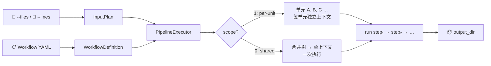
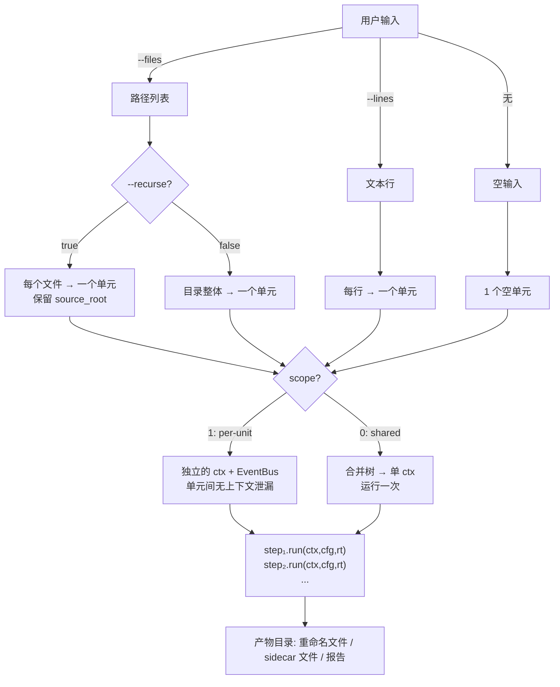

# Shell Worker Platform

按**单向管道**模型设计的模块化批量任务工作流平台，通过 YAML 编排步骤，对文件或文本输入执行批量处理、自动化任务。CLI 驱动，可选桌面 GUI，跨平台。



---

## 安装

```bash
pip install -r requirements.txt     # 内核 + CLI（仅 PyYAML）
pip install '.[gui]'                # + PySide6 桌面 GUI
pip install '.[win]'                # + pywinpty（Windows PTY）
```

Linux / macOS 上 CLI 零 GUI 依赖，PTY 由 stdlib 提供。

## 快速开始

```bash
# 1. 查看可用工作流和模块
python main_cli.py --list-workflows
python main_cli.py --list-modules

# 2. 无输入创建文件（atom=none）
python main_cli.py example-create.yaml --output-dir ./out
# → out/hello.txt

# 3. 批量重命名文件（atom=file, recurse=true）
python main_cli.py example-file-rename.yaml \
  --files ./my_data --recurse --output-dir ./out
# → 每个文件被安全拷贝后重命名，保留相对目录结构

# 4. 整个文件夹作为单元（atom=folder）
python main_cli.py example-folder-rename.yaml \
  --files ./my_folder --output-dir ./out
# → 文件夹整体作为一个任务，拷贝后重命名

# 5. 合并计数（atom=file, scope=0）
python main_cli.py example-cycle-count.yaml \
  --files ./my_data --recurse --output-dir ./out
# → 所有文件合并到产物目录，运行一次，输出 count.txt

# 6. 逐行处理文本（atom=line）
python main_cli.py example-line-echo.yaml \
  --lines "alpha"$'\n'"beta" --output-dir ./out
# → 每行作为一个独立任务

# 7. 调用外部工具
python main_cli.py example-external-tool.yaml \
  --files ./input --recurse --output-dir ./out
```

## 核心模型

每个工作流由三个正交参数控制执行行为：

```
atom       输入粒度       file / folder / line / none
scope      分发策略       0 (共享) / 1 (独立)
recurse    目录展开       true / false (仅 atom=file 时有效)
```



### 三参数速查

| | atom | scope | recurse |
|---|---|---|---|
| **含义** | 输入原子粒度 | 上下文分发 | 目录展开 |
| **值** | `file` `folder` `line` `none` | `0` `1` | `true` `false` |
| **定义位置** | 工作流 YAML | 工作流 YAML | CLI 参数 |
| **模块约束** | 须在 `MODULE_META.atom` 中 | 须匹配 `MODULE_META.scope` | 无 |

### 使用场景对照

| 场景 | atom | scope | recurse | 典型任务 |
|---|---|---|---|---|
| 文件格式转换、预处理、元数据注入、重命名 | `file` | `1` | `true` | 逐文件操作，保留目录结构 |
| 文件夹内批量重命名、打包归档 | `folder` | `1` | — | 整个文件夹作为一个任务 |
| API 调用、日志下载、直接产出文件 | `none` | `1` | — | 无输入，从零创建 |
| 网络爬虫、逐行 URL 下载 | `line` | `1` | — | 每行文本作为独立任务 |
| 混杂文件分类、跨文件统计计数 | `file` | `0` | `true` | 全量合并后一次执行 |

## 工作流 YAML

```yaml
meta:
  name: My Workflow
  description: 工作流描述
  version: "1.0.0"
atom: file              # file | folder | line | none
recurse: true           # 仅 atom=file 时有效；true 展开目录
steps:
  - module: my-module   # 模块 slug
    name: 步骤名称
    params:
      key: value
```

平台内置 6 个示例工作流，位于 `workflows/` 目录，可作为模板直接修改。

## CLI 参考

```
用法: shell-worker WORKFLOW [选项]

输入:
  --files PATH ...        文件/文件夹路径
  --recurse               递归展开文件夹
  --lines TEXT            文本输入（每行一个任务）
  --lines-file PATH       从文件读取文本（- 为 stdin）

执行:
  --output-dir DIR        产物目录 (默认 ./out)
  --direct                直接操作原始文件（跳过拷贝）
  --modules-dir DIR       模块目录 (默认 ./modules)
  --workflows-dir DIR     工作流目录 (默认 ./workflows)

日志:
  --log-file PATH         JSON 行式事件日志

自检:
  --list-workflows        列出全部工作流
  --list-modules          列出全部模块

退出码: 0=成功 | 1=部分失败 | 2=取消 | 3=参数非法
```

## 编写模块

`modules/` 下每个 `.py` 文件为一个模块。须导出三要素：

```python
MODULE_META = {
    "slug": "my-module",
    "name": "My Module",
    "core_version": "2.0.0",
    "tags": ["demo"],
    "atom": ["file"],
    "description": "模块功能描述",
}
CONFIG_SCHEMA = {
    "type": "object",
    "properties": {
        "suffix": {"type": "str", "title": "后缀", "default": "_done"},
    },
}

def run(ctx, cfg, runtime):
    """ctx: PipelineContext    cfg: 已校验的步骤参数    runtime: PipelineRuntime"""
    new_path = ctx.working_path.with_name(ctx.working_path.name + cfg["suffix"])
    ctx.working_path.rename(new_path)
    runtime.log("my-module", "success", f"已重命名: {new_path.name}")
    return ctx.clone(working_path=new_path)
```

要点：
- `MODULE_META.scope` 可选，默认 `1`。仅在需要强制共享模式时设 `"scope": 0`。
- `run()` 返回 `PipelineContext`（替换上下文）、`None`（保留原上下文）或 `{"context": ctx}` dict。
- 跨步骤共享数据写入 `ctx.shared`，下游步骤通过同名 key 读取。
- 调用外部程序使用 `runtime.spawn(command)`，跨平台 PTY 自动适配。

更多细节请阅读 `AGENTS.md`。
